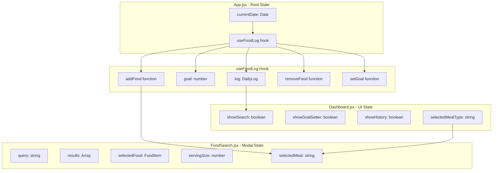
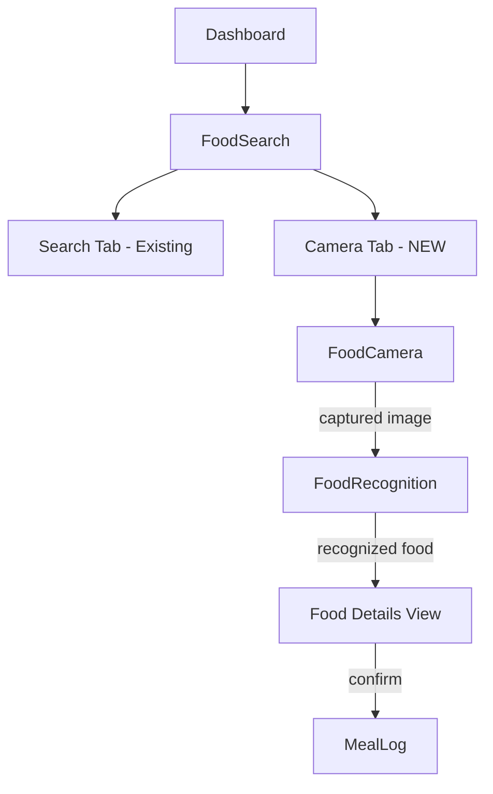
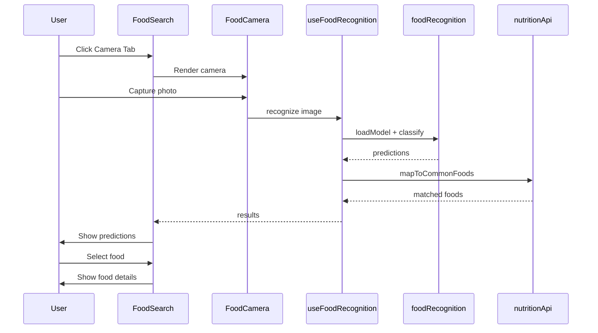

# Photo-Based Food Recognition Integration Plan

## Executive Summary

This document outlines the integration of a **free, client-side photo-based food recognition feature** into the existing Protein Tracker app using TensorFlow.js with a food classification model.

---

## Current Architecture Analysis

### State Flow Diagram



### Key Integration Points

| File | Current Responsibility | Integration Point |
|------|----------------------|-------------------|
| [`App.jsx`](src/App.jsx:8) | Root state management | No changes needed |
| [`Dashboard.jsx`](src/components/Dashboard.jsx:37) | Modal visibility state | Add `showCamera` state |
| [`FoodSearch.jsx`](src/components/FoodSearch.jsx:14) | Food search modal | Add camera tab/option |
| [`useFoodLog.js`](src/hooks/useFoodLog.js:29) | Food log operations | No changes needed |
| [`nutritionApi.js`](src/services/nutritionApi.js:175) | Food search API | Add recognition result mapping |

---

## Proposed Architecture

### New File Structure

```
src/
├── components/
│   ├── FoodSearch.jsx        # MODIFY: Add camera tab
│   ├── FoodCamera.jsx        # NEW: Camera capture component
│   └── FoodRecognition.jsx   # NEW: Recognition results display
├── services/
│   ├── nutritionApi.js       # MODIFY: Add food name mapping
│   └── foodRecognition.js    # NEW: TensorFlow.js integration
├── hooks/
│   └── useFoodRecognition.js # NEW: Recognition state hook
└── utils/
    └── constants.js          # MODIFY: Add recognition constants
```

### Component Hierarchy



---

## Detailed Implementation Steps

### Phase 1: Install Dependencies

**Step 1.1: Add TensorFlow.js packages**

```bash
npm install @tensorflow/tfjs @tensorflow-models/mobilenet
```

**Files affected:** `package.json`

---

### Phase 2: Create Recognition Service

**Step 2.1: Create [`src/services/foodRecognition.js`](src/services/foodRecognition.js)**

```javascript
// Pseudo-structure
import * as tf from '@tensorflow/tfjs'
import * as mobilenet from '@tensorflow-models/mobilenet'

// Model singleton
let model = null

export async function loadModel() {
  if (!model) {
    model = await mobilenet.load()
  }
  return model
}

export async function recognizeFood(imageElement) {
  const model = await loadModel()
  const predictions = await model.classify(imageElement)
  return mapToFoodItems(predictions)
}

function mapToFoodItems(predictions) {
  // Map MobileNet classes to food names
  // Return array of { name, confidence }
}
```

**Integration with [`COMMON_FOODS`](src/services/nutritionApi.js:122):**
- Map recognized food name to COMMON_FOODS entries
- Use fuzzy matching for food name similarity

---

### Phase 3: Create Camera Component

**Step 3.1: Create [`src/components/FoodCamera.jsx`](src/components/FoodCamera.jsx)**

**Props Interface:**
```typescript
interface FoodCameraProps {
  onCapture: (imageBlob: Blob, imageElement: HTMLImageElement) => void
  onClose: () => void
}
```

**Features:**
- Camera access via `navigator.mediaDevices.getUserMedia`
- Photo capture with canvas
- Preview before processing
- Retake option

**Step 3.2: Create [`src/components/FoodRecognition.jsx`](src/components/FoodRecognition.jsx)**

**Props Interface:**
```typescript
interface FoodRecognitionProps {
  imageBlob: Blob
  imageElement: HTMLImageElement
  onSelectFood: (food: FoodItem) => void
  onRetake: () => void
  onClose: () => void
}
```

**Features:**
- Show captured image
- Display loading state during recognition
- Show top 3 predictions with confidence scores
- Allow user to select correct food
- Fallback to manual search

---

### Phase 4: Modify FoodSearch Component

**Step 4.1: Add tab navigation to [`FoodSearch.jsx`](src/components/FoodSearch.jsx:79)**

**Current structure:**
```jsx
<div className="fixed inset-0 bg-black/50 z-50 flex flex-col">
  {/* Header */}
  {/* Results */}
</div>
```

**New structure:**
```jsx
<div className="fixed inset-0 bg-black/50 z-50 flex flex-col">
  {/* Header with tabs */}
  <div className="bg-white p-4">
    {/* Existing search input */}
    <div className="flex gap-2 mt-2">
      <Tab active>Search</Tab>
      <Tab>Camera</Tab>
    </div>
  </div>
  
  {/* Tab content */}
  {activeTab === 'search' && <SearchResults />}
  {activeTab === 'camera' && <FoodCamera onCapture={...} />}
</div>
```

**State additions:**
```javascript
const [activeTab, setActiveTab] = useState('search')
const [capturedImage, setCapturedImage] = useState(null)
const [recognitionResults, setRecognitionResults] = useState(null)
```

---

### Phase 5: Create Recognition Hook

**Step 5.1: Create [`src/hooks/useFoodRecognition.js`](src/hooks/useFoodRecognition.js)**

```javascript
export function useFoodRecognition() {
  const [loading, setLoading] = useState(false)
  const [error, setError] = useState(null)
  const [results, setResults] = useState([])
  
  const recognize = async (imageElement) => {
    setLoading(true)
    setError(null)
    try {
      const foods = await recognizeFood(imageElement)
      setResults(foods)
    } catch (err) {
      setError(err.message)
    }
    setLoading(false)
  }
  
  const reset = () => {
    setResults([])
    setError(null)
  }
  
  return { loading, error, results, recognize, reset }
}
```

---

### Phase 6: Update Constants

**Step 6.1: Add to [`src/utils/constants.js`](src/utils/constants.js)**

```javascript
export const RECOGNITION_CONFIG = {
  MIN_CONFIDENCE: 0.3,      // Minimum confidence to show result
  MAX_RESULTS: 3,           // Maximum predictions to display
  MODEL_LOAD_TIMEOUT: 10000 // 10 second timeout
}

// Food name mappings for MobileNet classes
export const FOOD_CLASS_MAPPINGS = {
  'banana': 'Banana',
  'pizza': 'Pizza',
  'hamburger': 'Hamburger',
  'hotdog': 'Hot Dog',
  'French loaf': 'Bread',
  'meat loaf': 'Meatloaf',
  'burrito': 'Burrito',
  'cheeseburger': 'Cheeseburger',
  'eggnog': 'Eggnog',
  'plate': 'Mixed Plate',
  // ... more mappings
}
```

---

## State Management Flow

### Recognition Flow Diagram



---

## Execution Roadmap

### Order of Operations

| Step | Action | File | Dependencies |
|------|--------|------|--------------|
| 1 | Install TensorFlow.js | `package.json` | None |
| 2 | Add recognition constants | `src/utils/constants.js` | None |
| 3 | Create recognition service | `src/services/foodRecognition.js` | Step 1, 2 |
| 4 | Create recognition hook | `src/hooks/useFoodRecognition.js` | Step 3 |
| 5 | Create camera component | `src/components/FoodCamera.jsx` | None |
| 6 | Create recognition results component | `src/components/FoodRecognition.jsx` | Step 4 |
| 7 | Modify FoodSearch with tabs | `src/components/FoodSearch.jsx` | Step 5, 6 |
| 8 | Add food name mapping | `src/services/nutritionApi.js` | Step 3 |
| 9 | Test integration | All | Step 1-8 |

---

## Risk Mitigation

### Potential Issues and Solutions

| Risk | Mitigation |
|------|------------|
| Model load time | Show loading indicator, cache model in memory |
| Low recognition accuracy | Always allow manual search fallback |
| Camera permission denied | Graceful fallback to search tab |
| Mobile browser compatibility | Feature detection before showing camera option |
| Large bundle size | Lazy load TensorFlow.js only when camera tab opened |

---

## Testing Checklist

- [ ] TensorFlow.js loads successfully
- [ ] Camera access works on mobile
- [ ] Photo capture and preview works
- [ ] Recognition returns results
- [ ] Results map to COMMON_FOODS
- [ ] User can select from predictions
- [ ] User can fallback to manual search
- [ ] Food is added to log correctly
- [ ] Works offline after model cached

---

## Next Steps

1. **User Approval**: Review this plan and confirm approach
2. **Switch to Code Mode**: Implement the features in order
3. **Incremental Testing**: Test each phase before moving to next
4. **Final Integration**: End-to-end testing

---

## Questions for User

1. Should the camera tab be the default view, or keep search as default?
2. Do you want to save captured photos locally for reference?
3. Should we show a confidence threshold indicator for predictions?
4. Any specific foods you want prioritized in recognition mapping?
