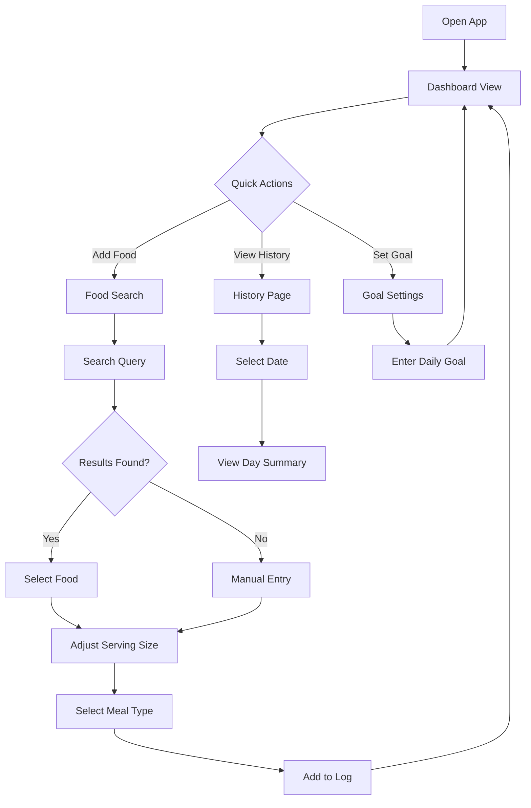

# Gym Protein Tracker App - Architecture Plan

## Overview
A personal web application for tracking daily protein intake from food items. The app uses open source nutrition databases to automatically fetch protein content and helps you reach your daily protein goals.

## Tech Stack Recommendation

### Frontend
- **React 18** with **Vite** - Fast, modern build tool with excellent mobile support
- **Tailwind CSS** - Utility-first CSS for rapid mobile-first UI development
- **React Router** - Simple navigation between views

### Data Storage
- **Local Storage** - Browser-based persistence, no server needed
- Works offline, data stays on your phone

### Nutrition Data API
- **Open Food Facts API** (primary) - Free, open source food database with 2.7M+ products
- **USDA FoodData Central API** (fallback) - US government free nutrition database

### Optional Deployment
- **Vercel** or **Netlify** - Free hosting for static sites

---

## Core Features

### 1. Daily Protein Dashboard
- Visual progress bar showing protein consumed vs daily goal
- Quick stats: total protein, remaining protein, meals logged
- Date navigation to view previous days

### 2. Food Search & Add
- Search bar with autocomplete
- Search open source nutrition databases
- Display protein content per serving
- Custom serving size adjustment
- Manual entry option for homemade foods

### 3. Meal Logging
- Add food items to daily log
- Categorize by meal type: Breakfast, Lunch, Dinner, Snacks
- Edit/delete logged items
- Quick-add recent/favorite foods

### 4. Goal Setting
- Set daily protein target in grams
- Adjustable based on fitness goals

### 5. History & Analytics
- View past days protein intake
- Weekly summary
- Simple chart visualization

---

## App Architecture

```
proteinApp/
|-- src/
|   |-- components/
|   |   |-- Dashboard.jsx       # Main dashboard with progress
|   |   |-- FoodSearch.jsx      # Search and add foods
|   |   |-- MealLog.jsx         # Daily meal log display
|   |   |-- ProgressBar.jsx     # Visual protein progress
|   |   |-- FoodCard.jsx        # Individual food item display
|   |   |-- GoalSetter.jsx      # Set daily protein goal
|   |   |-- History.jsx         # Past days view
|   |   |-- Navigation.jsx      # Bottom nav for mobile
|   |-- services/
|   |   |-- nutritionApi.js     # API calls to Open Food Facts/USDA
|   |   |-- storage.js          # Local storage operations
|   |-- hooks/
|   |   |-- useFoodLog.js       # Custom hook for log management
|   |   |-- useNutrition.js     # Custom hook for API calls
|   |-- utils/
|   |   |-- formatters.js       # Date/number formatting
|   |   |-- constants.js        # App constants
|   |-- App.jsx                 # Main app component
|   |-- main.jsx                # Entry point
|   |-- index.css               # Tailwind imports
|-- public/
|   |-- favicon.ico
|-- index.html
|-- package.json
|-- vite.config.js
|-- tailwind.config.js
|-- postcss.config.js
```

---

## Data Models

### DailyLog
```javascript
{
  date: "2026-02-18",
  goal: 150, // grams
  meals: [
    {
      id: "uuid",
      type: "breakfast",
      foods: [
        {
          id: "uuid",
          name: "Chicken Breast",
          protein: 31, // grams
          servingSize: 100, // grams
          servingUnit: "g",
          source: "usda", // or "openfoodfacts" or "custom"
          timestamp: "2026-02-18T08:30:00Z"
        }
      ]
    }
  ],
  totalProtein: 31
}
```

### FoodItem (from API)
```javascript
{
  name: "Chicken Breast",
  proteinPer100g: 31,
  caloriesPer100g: 165,
  source: "usda",
  barcode: null // optional
}
```

---

## User Flow Diagram



---

## API Integration

### Open Food Facts API
- **Endpoint**: `https://world.openfoodfacts.org/api/v2/search`
- **Free**: No API key required
- **Rate limit**: Respectful use requested
- **Data**: Protein, carbs, fat, calories per 100g

### USDA FoodData Central API
- **Endpoint**: `https://api.nal.usda.gov/fdc/v1/foods/search`
- **Free**: API key required (free signup)
- **Data**: Comprehensive nutrition data

---

## Mobile-First Design Principles

1. **Touch-friendly**: Large tap targets (min 44px)
2. **Bottom navigation**: Easy thumb access
3. **Swipe gestures**: For common actions
4. **Minimal typing**: Autocomplete, recent items
5. **Offline support**: Local storage works without internet
6. **Fast loading**: Vite + lazy loading

---

## Implementation Phases

### Phase 1: Foundation
- Set up React + Vite project
- Configure Tailwind CSS
- Create basic layout and navigation
- Implement local storage service

### Phase 2: Core Features
- Build dashboard with progress bar
- Implement food search with API
- Create meal logging functionality
- Add goal setting

### Phase 3: Polish
- Add history view
- Implement favorites/recent foods
- Add meal type categorization
- Mobile optimization

### Phase 4: Enhancement (Optional)
- Add charts/analytics
- Barcode scanning (if needed)
- Export data feature
- Dark mode

---

## Questions for Consideration

1. Do you want barcode scanning capability for packaged foods?
2. Would you like to track other macros (carbs, fats, calories) alongside protein?
3. Any specific color scheme preference for the UI?
4. Do you want the app to work completely offline, or is internet access okay?

---

## Next Steps

Once you approve this plan, we can switch to **Code mode** to start building the application. The implementation will follow the phases outlined above.