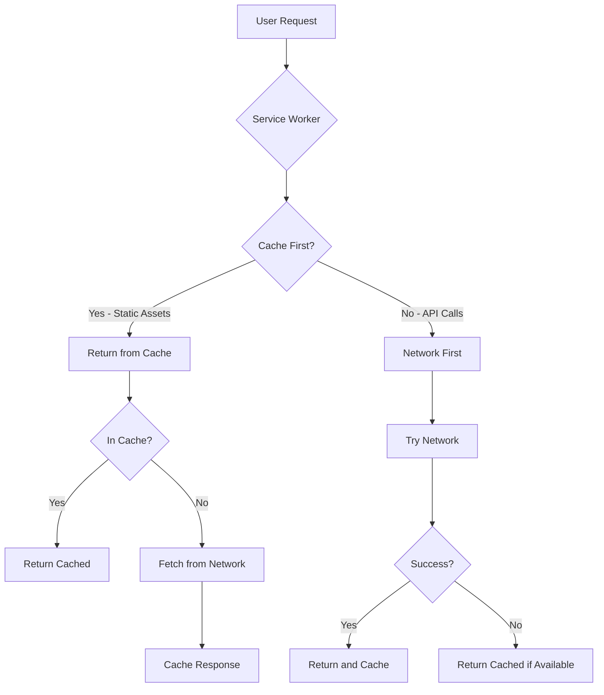

# PWA Conversion Plan for Protein Tracker

## Overview

Convert the existing Protein Tracker React/Vite application into a Progressive Web App (PWA) that users can install on their homescreen from mobile and desktop browsers.

## Current State

- **Framework**: React 18 with Vite 5
- **Existing Assets**: SVG icon at [`public/protein-icon.svg`](public/protein-icon.svg)
- **Theme Color**: `#059669` (emerald green)
- **Storage**: Uses localStorage for data persistence

## Implementation Plan

### 1. Install Dependencies

Add the Vite PWA plugin which handles service worker generation and manifest creation:

```bash
npm install -D vite-plugin-pwa
```

### 2. Update [`vite.config.js`](vite.config.js)

Configure the PWA plugin with manifest settings and service worker strategy:

```javascript
import { defineConfig } from 'vite'
import react from '@vitejs/plugin-react'
import { VitePWA } from 'vite-plugin-pwa'

export default defineConfig({
  plugins: [
    react(),
    VitePWA({
      registerType: 'prompt',  // Show update prompt to user
      includeAssets: ['protein-icon.svg'],
      manifest: {
        name: 'Protein Tracker',
        short_name: 'Protein',
        description: 'Track your daily protein intake for your fitness goals',
        theme_color: '#059669',
        background_color: '#ffffff',
        display: 'standalone',
        orientation: 'portrait',
        scope: '/',
        start_url: '/',
        icons: [
          {
            src: 'pwa-192x192.png',
            sizes: '192x192',
            type: 'image/png'
          },
          {
            src: 'pwa-512x512.png',
            sizes: '512x512',
            type: 'image/png'
          },
          {
            src: 'pwa-512x512.png',
            sizes: '512x512',
            type: 'image/png',
            purpose: 'maskable'
          }
        ]
      },
      workbox: {
        globPatterns: ['**/*.{js,css,html,ico,png,svg,woff2}'],
        runtimeCaching: [
          {
            urlPattern: /^https:\/\/api\.nutritionix\.com\/.*/i,
            handler: 'NetworkFirst',
            options: {
              cacheName: 'nutrition-api-cache',
              expiration: {
                maxEntries: 100,
                maxAgeSeconds: 60 * 60 * 24 // 24 hours
              }
            }
          }
        ]
      }
    })
  ]
})
```

### 3. Update [`index.html`](index.html)

Add PWA-specific meta tags:

```html
<!DOCTYPE html>
<html lang="en">
  <head>
    <meta charset="UTF-8" />
    <link rel="icon" type="image/svg+xml" href="/protein-icon.svg" />
    <meta name="viewport" content="width=device-width, initial-scale=1.0, maximum-scale=1.0, user-scalable=no" />
    
    <!-- PWA Meta Tags -->
    <meta name="theme-color" content="#059669" />
    <meta name="description" content="Track your daily protein intake for your fitness goals" />
    <meta name="apple-mobile-web-app-capable" content="yes" />
    <meta name="apple-mobile-web-app-status-bar-style" content="default" />
    <meta name="apple-mobile-web-app-title" content="Protein Tracker" />
    <link rel="apple-touch-icon" href="/pwa-192x192.png" />
    
    <title>Protein Tracker</title>
  </head>
  <body>
    <div id="root"></div>
    <script type="module" src="/src/main.jsx"></script>
  </body>
</html>
```

### 4. Generate PWA Icons

Create PNG icons from the existing SVG. The required sizes are:

| Size | Purpose | Filename |
|------|---------|----------|
| 192x192 | Standard icon for Android | `pwa-192x192.png` |
| 512x512 | High-res icon for Android | `pwa-512x512.png` |
| 180x180 | Apple Touch Icon | `apple-touch-icon.png` |

**Options for icon generation:**
1. Use an online tool like [RealFaviconGenerator](https://realfavicongenerator.net/)
2. Use a local tool like ImageMagick: `convert -background none protein-icon.svg -resize 192x192 pwa-192x192.png`
3. Use a Node.js script with sharp package

### 5. Service Worker Configuration

The service worker will be auto-generated by vite-plugin-pwa with the following caching strategy:



### 6. Optional: Install Prompt Component

Create a custom install prompt UI to encourage users to add the app to their homescreen:

```jsx
// src/components/InstallPrompt.jsx
// This component will show a prompt when PWA installation is available
```

## Files to Create/Modify

### New Files
| File | Purpose |
|------|---------|
| `public/pwa-192x192.png` | 192x192 PWA icon |
| `public/pwa-512x512.png` | 512x512 PWA icon |
| `public/apple-touch-icon.png` | Apple touch icon |
| `src/components/InstallPrompt.jsx` | Optional install prompt UI |

### Modified Files
| File | Changes |
|------|---------|
| `package.json` | Add vite-plugin-pwa dependency |
| `vite.config.js` | Add PWA plugin configuration |
| `index.html` | Add PWA meta tags |

## Offline Support Details

The app will support offline functionality for:

1. **App Shell**: All static assets (JS, CSS, HTML) cached on install
2. **User Data**: Already stored in localStorage
3. **API Responses**: Nutrition API responses cached for 24 hours

**Note**: The TensorFlow-based food recognition feature requires internet and will not work offline.

## Testing the PWA

1. Build the app: `npm run build`
2. Preview: `npm run preview`
3. Test with Chrome DevTools:
   - Open DevTools > Application tab
   - Check Manifest section
   - Check Service Workers section
   - Test offline mode in Network tab

## Browser Support

| Browser | Install Support |
|---------|-----------------|
| Chrome Android | ✅ Full support |
| Safari iOS | ✅ Add to Home Screen |
| Chrome Desktop | ✅ Install prompt |
| Firefox Android | ✅ Full support |
| Edge Desktop | ✅ Install prompt |

## Next Steps

1. Switch to Code mode to implement the changes
2. Generate icons from the SVG
3. Test the installation flow
